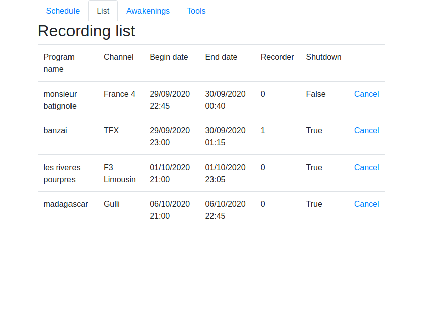
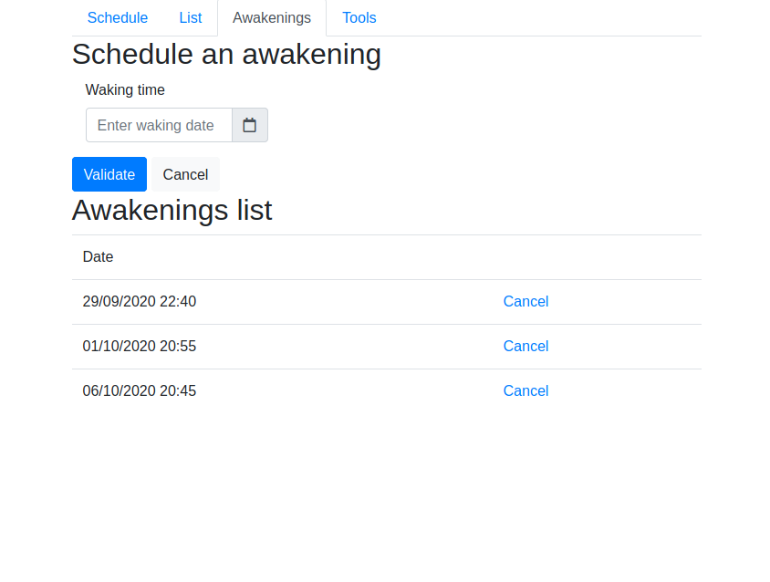

Version
=======

0.7.0

Presentation
============

This application is a video recorder for a media server fitted with DVB video
adapters. It works as a web server, so you have to use a web browser to schelule
your recording sessions.

Yon can paralellize the recordings using multiple adapters. The PC can be shut
down at the end of any recording. Furthermore, the PC can be started any number
of times.

For example in the following screenshots, there is 3 recording sequences. In the
first one, you have the following envents :

- the PC is started at sept 29, 2020 at 10:40 pm ;
- the recording of "Monsieur Batignole" starts at 10:45 pm till Sept 30,
  0:40 am on adapter 0 ;
- the recording of "Banzaï" starts at 11:00 pm till Sept 30,
  1:15 am on adapter 1 ;
- the PC is shut down at the end of the last recording.

Screenshots
===========

.. image:: images/schedule.png

Preparation
==========

Generation of the initial file :

- get the channels numbers ;
- insert them in the script `tools/make-channels-conf.sh`
- execute the script :

.. code_block::

    tools/make-channels-conf.sh > transmitters/xx-place.conf

Generation of the channels configuration file :

.. code_block::

   cd transmitters
   dvbv5-scan -F -I channel -O zap -o channels-place.conf xx-place.conf

Downloads
=========

These softwares are stored in the static directory. This is just a reminder on
where they have been taken and what are the versions used here :

- `JQuery <https://code.jquery.com/jquery/>`_ - Version 3.5.1 ;
- `Bootstrap 4 <http://getbootstrap.com/>`_ - Version 4.5.2 ;
- `Popper <https://popper.js.org/>`_- Version 2.5.1 ;
- `Moment <https://momentjs.com/>`_- Version 2.29.0 ;
- `Tempus Dominus - Bootstrap 4 <https://github.com/tempusdominus/bootstrap-4>`_ - Version 5.1.2 ;
- `Font Awesome <https://fontawesome.com/>`_- Version 5.14.0 ;

Internationalization
====================

Creation : ::

    pybabel extract -F babel-mapping.ini -k _ -k _l --no-wrap -o locales/messages.pot .
    pybabel init -i messages.pot -d translations -l en
    pybabel init -i messages.pot -d translations -l fr
    pybabel compile -d translations

Update : ::

    pybabel extract -F babel-mapping.ini -k _ -k _l --no-wrap -o locales/messages.pot .
    pybabel update -i messages.pot --no-wrap -d translations
    pybabel compile -d translations

Note
====

I use the github version of aiohttp-babel because I use a feature that is not
included in the latest release.
